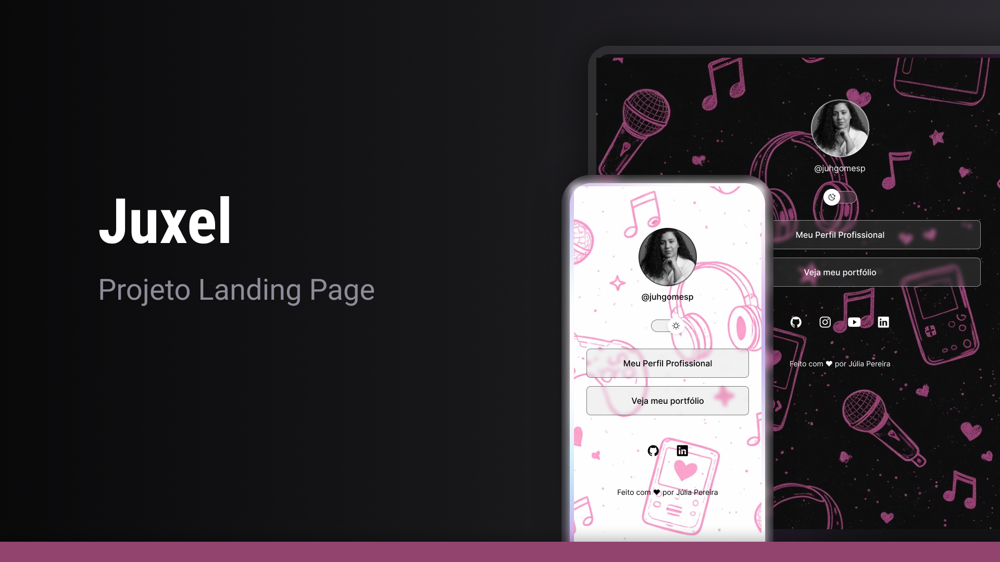

<h1 align="center">🌐 Projeto Landing Page</h1>

Este é um projeto de landing page desenvolvido com HTML, CSS e JavaScript, com foco em apresentar links 
pessoais e profissionais de forma moderna e responsiva.

## 📸 Preview

---

## 🚀 Tecnologias utilizadas

- HTML5  
- CSS  
- JavaScript  
- Figma
- Git e Github  

---

## 🎯 Funcionalidades

- Alternância de tema (dark/light mode)
- Links para redes sociais
- Layout responsivo
- Interface moderna e minimalista

---

## 🔗 Acesse o projeto online

👉 https://juhgomesp.github.io/Projeto-Landing-Page-/

---

## 👩‍💻 Autora

Feito com 💜 por **Júlia Gomes**

- LinkedIn: https://www.linkedin.com/in/juliagomespereira/
- GitHub: https://github.com/juhgomesp

---

## 📌 Status do projeto

✅ Finalizado  
🚀 Em constante evolução  

---

## 💡 Melhorias futuras

- Adicionar animações
- Melhorar acessibilidade
- Otimização para SEO
